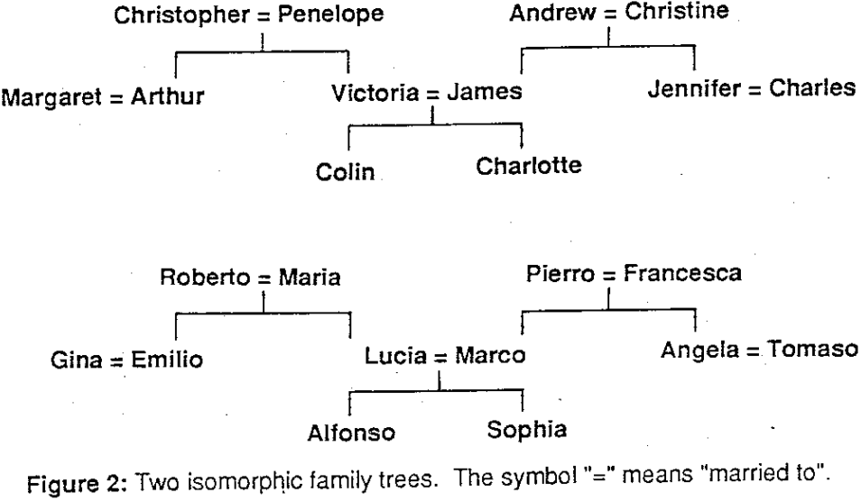
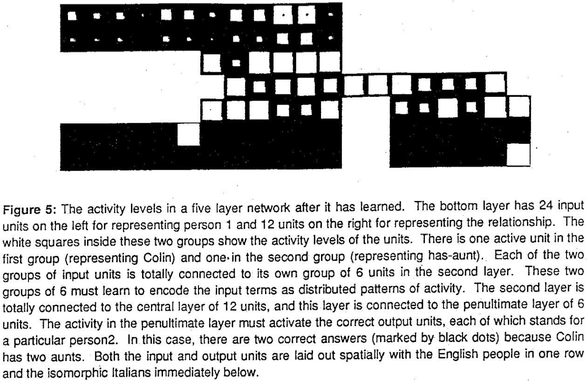
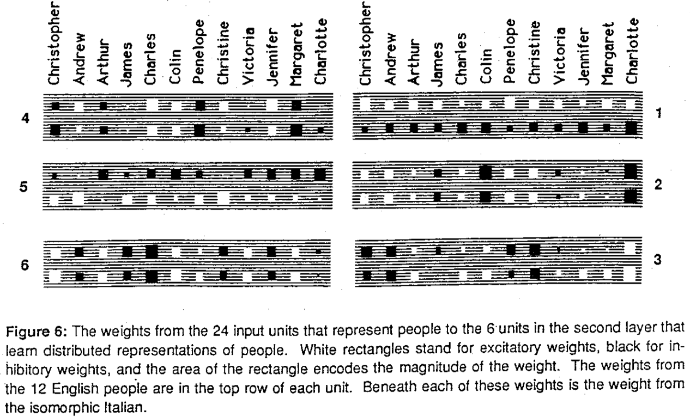
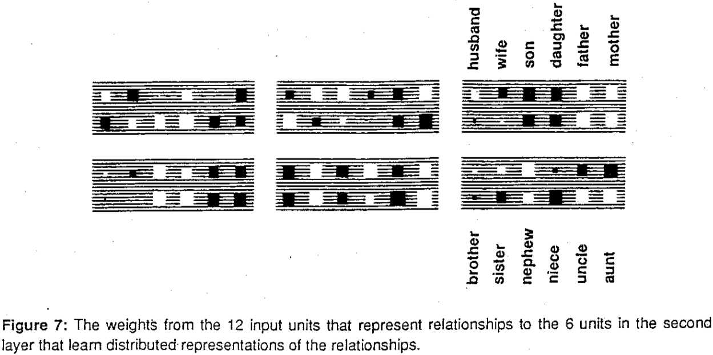
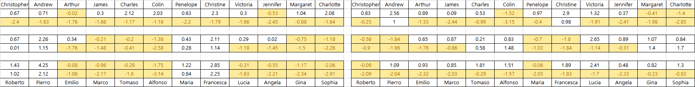
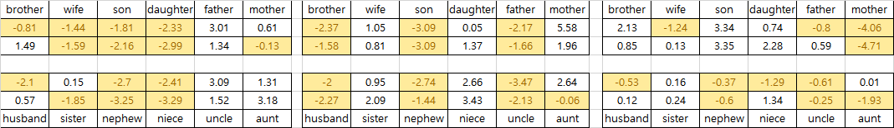

# ft_hinton86
c++ implementation of http://www.cs.toronto.edu/~fritz/absps/ieee-lre.pdf
Originally, I uploaded this source code to my blog(sephiroce.com) in 2016 as a h/w for a Neural network lecture.

The purpose of this paper(Hinton '86) is teaching NN to understand relationships between P1 and P2.

<b>Family Tree</b>

The family tree above can be expressed by a set of tripletts.

Person1	Relation	Person2
Christopher	wife	Penelope
Arthur	wife	Margaret
James	wife	Victoria
Andrew	wife	Christine
Charles	wife	Jennifer
Roberto	wife	Maria
Pierro	wife	Francesca

The family tree contains 104 triplett.(FamilyTree.xlsx)

<b>Neural Network Structure</b>

<b>Feed forward</b>
There are not bias nodes.
\r\n\r\nNon-linear function(sigmoid function)\r\n
The units are arrainged in layers with a layer of input uints at the bottom, any number of intermediate layers, and a layer of output uints at the top. There no feedback connections.

<b>Back propagation</b>
Squared residual errors, no bias node, Batch mode

acceleration medthod : delta W(t-1)

t is incremented by 1 for each sweep through the whole set of input-output cases, and alpha is an exponential decay factor between 0 and 1 that determines the relative contribution of the current gradient and ealier gradients on the weight change.

The results.

Weights from the 24 input units for people

Weights from the 12 input units for relations

My model got 2 out of 4 test cases,
wheree "correct" means that the output unit corresponding to the right answer had an activity level above 0.5, and all the other output units were below 0.5.
